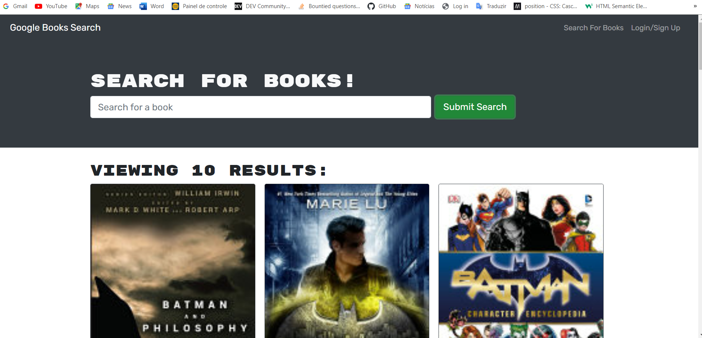
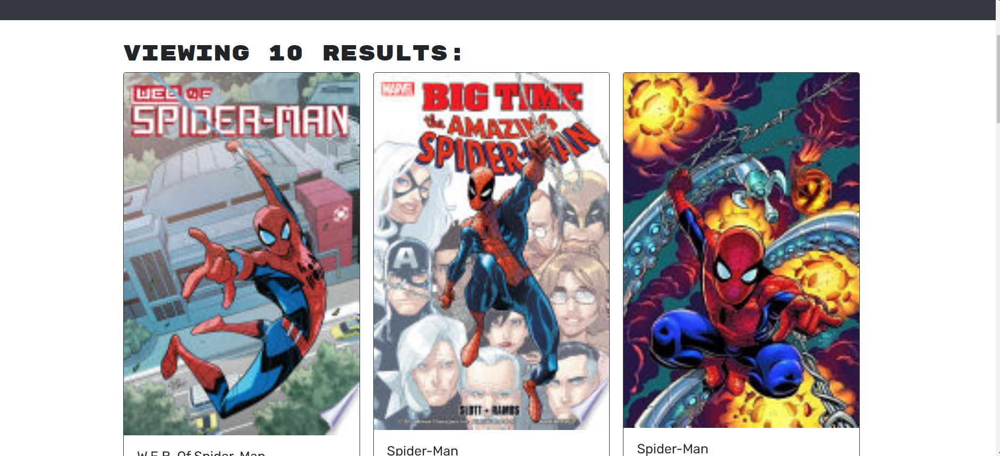

# book-search-engine
 ## MERN Challenge: Book Search Engine ✅✨

 ## Description

    This is a MERN stack application that allows users to search for books and save them to their profile. This application was built using the MERN stack with a React front end, MongoDB database, and Node.js/Express.js server and API. It was refactored from a RESTful API to a GraphQL API built with Apollo Server.     

    ## Table of Contents

    * [Installation](#installation)
    * [Usage](#usage)
    * [License](#license)

    ## Installation

    To install necessary dependencies, run the following command:

    ``` 
    npm i
    ```
    ## Usage

    To run the application locally, run the following command:

    ```
    npm start
    npm run build
    ```
    ## License

    This project is licensed under the MIT license.


 ## Links

    * [GitHub Repository](https://github.com/Vinni99/book-search-engine)


    ## Screenshots




